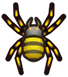

# Animal Crossing: New Horizons Icon Theme for VS Code

An Animal Crossing: New Horizons themed icon pack for VS Code!
Uses inventory sprites from AC:NH to bring your code editor to island life.

## Icon Reference

| Icon | ACNH Item | File Types |
|:----:|-----------|------------|
|  | Green Leaf | Default (all unmapped files) |
|  | Coral | `.html`, `.htm` |
|  | Wand | `.css` |
|  | Recipe | `.js`, `.jsx` |
|  | Fossil | `.ts`, `.tsx`, `.proto` |
|  | Money Bag | `.json`, `jsconfig.json`, `tsconfig.json` |
|  | Book | `.md`, `.yml`, `.yaml` |
|  | Turnips | `.py`, `.pyw` |
|  | Cherry | `.rb`, `.erb`, `Gemfile`, `Rakefile` |
|  | Peach | Images (`.jpg`, `.png`, `.gif`, `.svg`, `.bmp`, `.ico`) |
|  | Recipe Bottle | `.log`, changelogs |
|  | Nook Miles Ticket | `.git`, `README` |
|  | Wasp Nest | `.gitignore`, `.babelrc` |
|  | Pitfall Seed | `.lock`, `.env` files |
|  | Present | `package.json` |
|  | Tree Branch | `LICENSE`, `COPYRIGHT` |
|  | Nugget Gold | Test files (`.snap`) |
|  | Fishing Rod | ESLint, TSLint configs |
|  | Cosmos Pink | Prettier configs |
|  | Net | Jest, Vitest configs |
|  | Star | Apollo config |
|  | Spider | `.graphql` |
|  | Axe Iron | Bazel, VS Code settings, `.sh`, `.bash`, `.zsh` |
|  | Egg Wood | Dockerfile, docker-compose |
|  | Hyacinths Purple | Fusion config |
|  | Pale Chub | Cerberus, `.thrift` |
|  | Coral | `.editorconfig`, webpack/rollup/vite configs |
|  | Clump of Weeds | Folders |

### Not yet mapped

These common file types currently use the default Green Leaf — future icon assignments welcome!

`.txt`, `.go`, `.java`, `.c`, `.cpp`, `.h`, `.rs`, `.swift`, `.php`, `.sql`, `.toml`, `.xml`, `.vue`, `.svelte`, `.scss`, `.sass`, `.less`, `.tf`, `.tfvars`, `.lua`, `.kt`, `.r`, `.csv`

## Development

This extension uses image files from `icons/acnh/` mapped in `icons.json`.

Open this repo in VS Code and press F5 to test.

### Prerequisites

```
npm install -g @vscode/vsce
```

### Publish to VS Code Marketplace

Update the version in `package.json`, then:

```
vsce publish
```

### Package for sharing

```
vsce package
```

Install the generated `.vsix`:

```
code --install-extension vscode-acnh-icon-theme-0.0.8.vsix
```

## Resources

Icons inspired by Animal Crossing: New Horizons by Nintendo.
